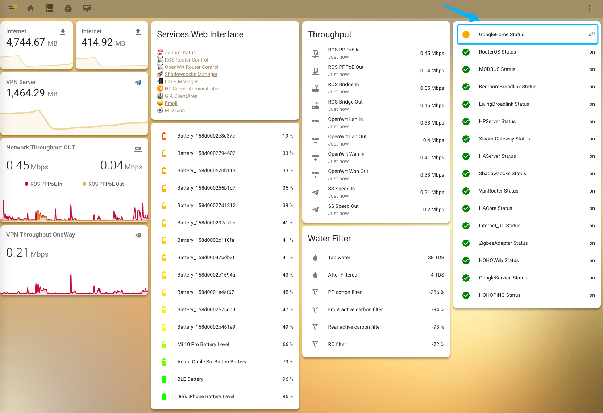
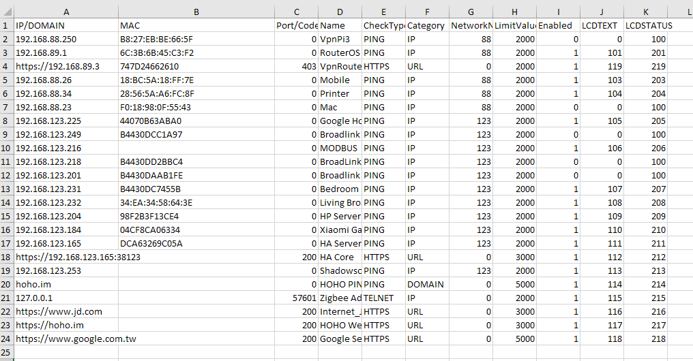
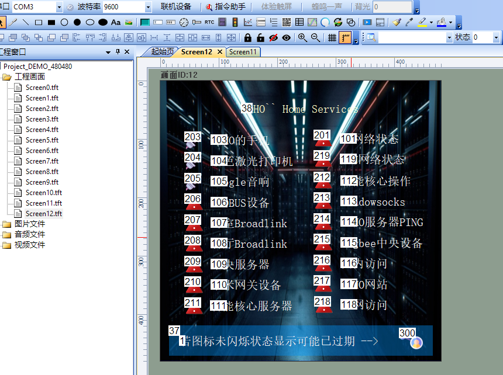
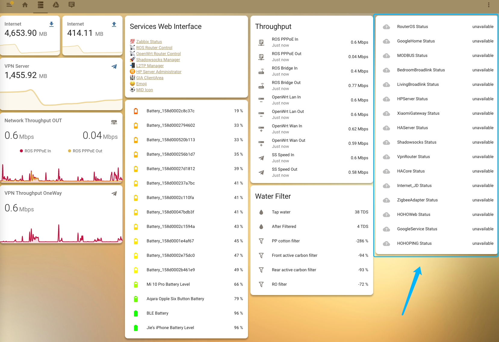

# HOHO Home Device Status

> For device status directly showing on TFT screen and HA sensors. 

> It helps you handle the problems once you found them in "the 1st time (第一时间)".




## Detection Type
- HTTPS
- TELNET
- PING

## Pushing Message Supports
- TCP(485)
- UDP(485)
- UDP(Binary)
- MQTT

## Configuration
> using CSV as program configuration.



## TFT Configuration



## Home assistant Supports
> by using the HA -> Add-ons -> Mosquitto broker

> no additional configuration in HA except the Lovelace(web page)

### once the process been terminated unexcepted


Node-red Content:
```
[{"id":"f0746e61.d37a9","type":"mqtt in","z":"79798a1b.031e04","name":"","topic":"homeassistant/sensor/hoho_status_boss/state","qos":"2","datatype":"utf8","broker":"aa97b9f2.467d98","x":210,"y":780,"wires":[["85f51f6e.14443"]]},{"id":"85f51f6e.14443","type":"switch","z":"79798a1b.031e04","name":"","property":"payload","propertyType":"msg","rules":[{"t":"eq","v":"on","vt":"str"},{"t":"else"}],"checkall":"true","repair":false,"outputs":2,"x":470,"y":780,"wires":[[],["89bbb83f.78e8a8"]]},{"id":"2699610.bbb6fa","type":"mqtt in","z":"79798a1b.031e04","name":"","topic":"homeassistant/sensor/+/state","qos":"0","datatype":"utf8","broker":"aa97b9f2.467d98","x":160,"y":840,"wires":[["1cbf2cce.22aac3"]]},{"id":"1cbf2cce.22aac3","type":"function","z":"79798a1b.031e04","name":"saves status item into flow var","func":"var current = flow.get(\"hoho_status\");\nif (current == undefined){\n    current = []\n}\nif (!current.includes(msg.topic)){\n    current.push(msg.topic);\n}\nflow.set(\"hoho_status\",current);","outputs":1,"noerr":0,"initialize":"","finalize":"","x":530,"y":840,"wires":[[]]},{"id":"89bbb83f.78e8a8","type":"function","z":"79798a1b.031e04","name":"set all status to unavailable","func":"var current = flow.get(\"hoho_status\");\nif (current == undefined){\n    return;\n}\ncurrent.forEach(function(val, idx) {\n    if (!val.includes(\"boss\")){\n        msg.topic = val;\n        msg.payload = \"unavailable\";\n        node.send(msg);\n    }\n});\nreturn;","outputs":1,"noerr":0,"initialize":"","finalize":"","x":700,"y":780,"wires":[["d2b65963.6467a8"]]},{"id":"d2b65963.6467a8","type":"mqtt out","z":"79798a1b.031e04","name":"","topic":"","qos":"","retain":"","broker":"aa97b9f2.467d98","x":810,"y":840,"wires":[]},{"id":"aa97b9f2.467d98","type":"mqtt-broker","name":"HA","broker":"127.0.0.1","port":"1883","clientid":"","usetls":false,"compatmode":false,"keepalive":"60","cleansession":true,"birthTopic":"","birthQos":"0","birthPayload":"","closeTopic":"","closeQos":"0","closePayload":"","willTopic":"","willQos":"0","willPayload":""}]
```

### HA Lovelace
**custom:auto-entities** & **custom:template-entity-row** in **HACS**

Card Content:
```
type: 'custom:auto-entities'
card:
  type: entities
filter:
  include:
    - domain: sensor
      entity_id: '*status'
      options:
        type: 'custom:template-entity-row'
        icon: |
           
            mdi:check-circle
          
            mdi:alert-circle
          
            mdi:cloud-question
          
        style: |
          :host {
            --paper-item-icon-color: 
               
                orange
              
                green
              
                red
              
                ;
            animation: 
              
                blink 2s ease infinite
              
                ;
            }
  exclude:
    - domain: sensor
      entity_id: '*printer*status'
    - domain: sensor
      entity_id: '*mobile*status'
sort:
  method: state
  reverse: false
```